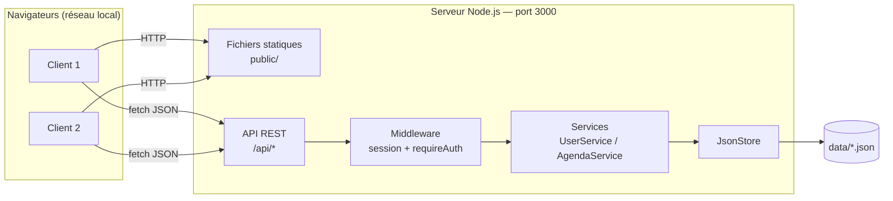
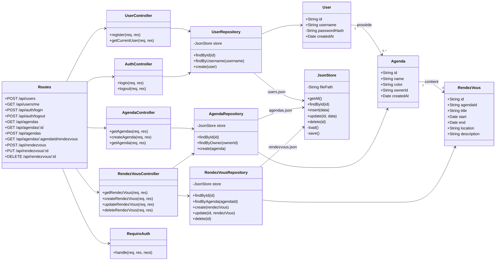

# Sprint 0: Conception

## 1. Architecture générale

Un serveur unique Node.js / Express qui :
- sert les pages Web statiques (`public/`) ;
- expose une API REST JSON sous le préfixe `/api` ;
- persiste les données dans des fichiers JSON (`data/`).




## 2. Choix techniques

| Besoin | Choix | Justification |
|--------|-------|---------------|
| Serveur HTTP | Express | Simple, standard, routes statiques + API dans un même serveur |
| Sessions | `express-session` (cookie de session) | Gestion simple de l'identification multi-utilisateurs |
| Mots de passe | `bcryptjs` | Stockage haché, jamais en clair |
| Identifiants | `crypto.randomUUID()` | Natif Node.js, pas de dépendance |
| Persistance | Fichiers JSON | Autorisé par le sujet, pas de base de données à déployer |
| Écriture fichiers | Écriture dans un fichier temporaire puis `rename` | Évite de corrompre les données si le serveur s'arrête pendant une écriture |
| Client | HTML / CSS / JavaScript (`fetch`) | Pas de build nécessaire, lancement direct |

# Diagramme de classes



## 4. API REST: Sprint 0

| Méthode | Route | Auth | Corps (JSON) | Réponse |
|---------|-------|------|--------------|---------|
| GET | `/` | Non | — | `index.html` |
| POST | `/api/auth/register` | Non | `{ username, password }` | `201` utilisateur créé / `400` champ vide / `409` nom déjà pris |
| POST | `/api/auth/login` | Non | `{ username, password }` | `200` utilisateur / `401` identifiants invalides |
| POST | `/api/auth/logout` | Oui | — | `204` |
| GET | `/api/auth/me` | Oui | — | `200` utilisateur connecté / `401` |
| GET | `/api/agendas` | Oui | — | `200` liste des agendas de l'utilisateur |
| POST | `/api/agendas` | Oui | `{ name, color? }` | `201` agenda créé / `400` nom vide |

L'API ne renvoie jamais `passwordHash` (méthode `User.toPublic()`).

## 5. Format des fichiers de données

`data/users.json`
```json
[
  {
    "id": "b3f1c2e4-...",
    "username": "manuel",
    "passwordHash": "$2b$10$...",
    "createdAt": "2026-10-01T10:00:00.000Z"
  }
]
```

`data/agendas.json`
```json
[
  {
    "id": "a91d7f20-...",
    "name": "Cours",
    "color": "#3b82f6",
    "ownerId": "b3f1c2e4-...",
    "createdAt": "2026-10-01T10:05:00.000Z"
  }
]
```
