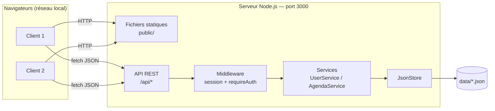
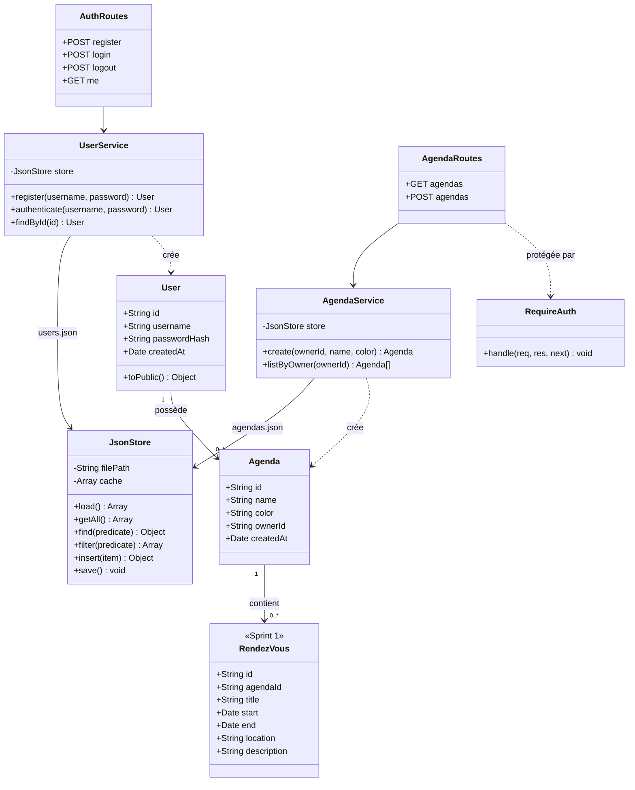
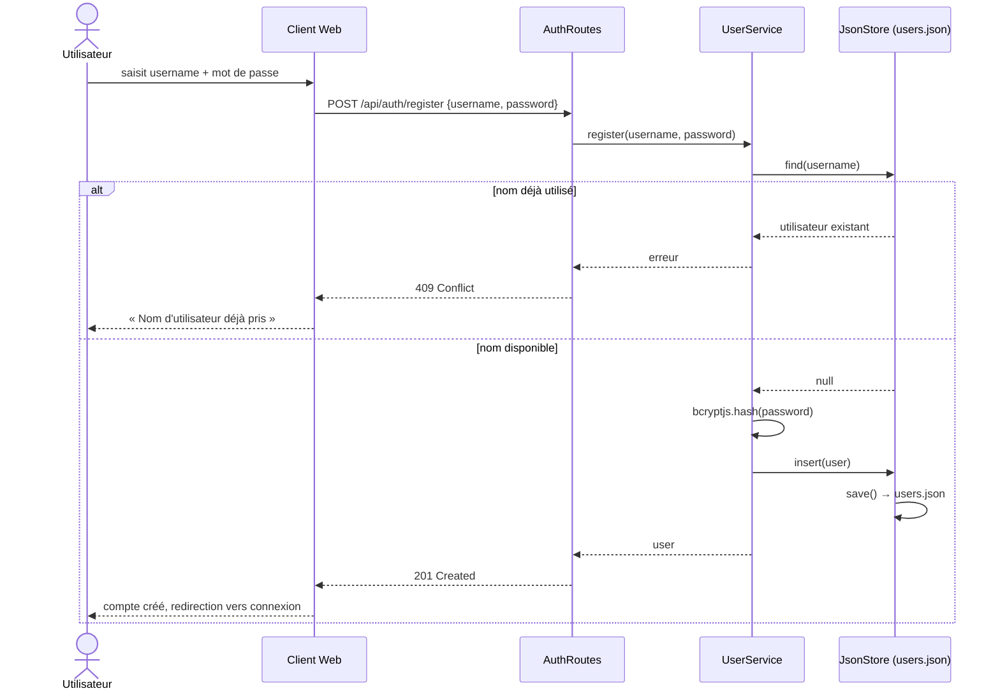
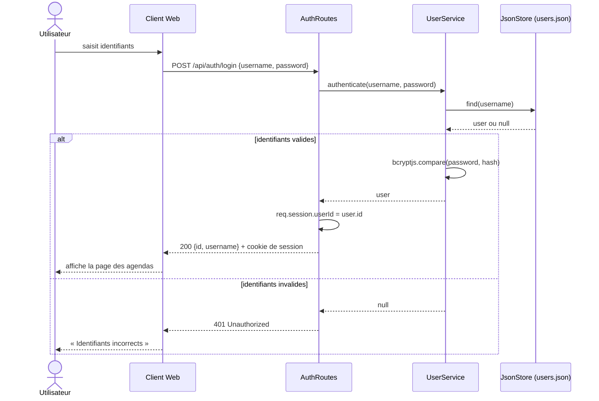
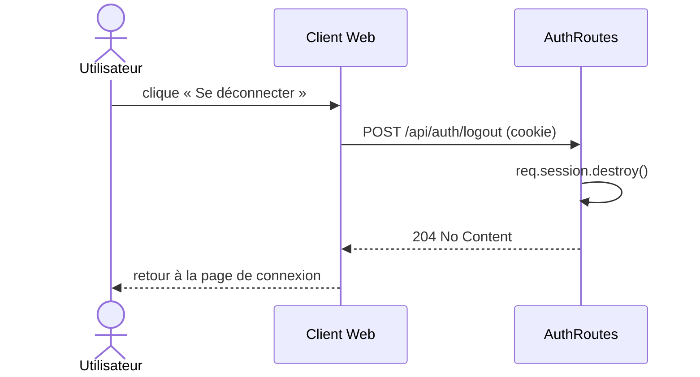
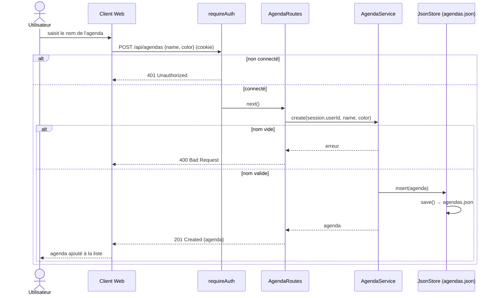
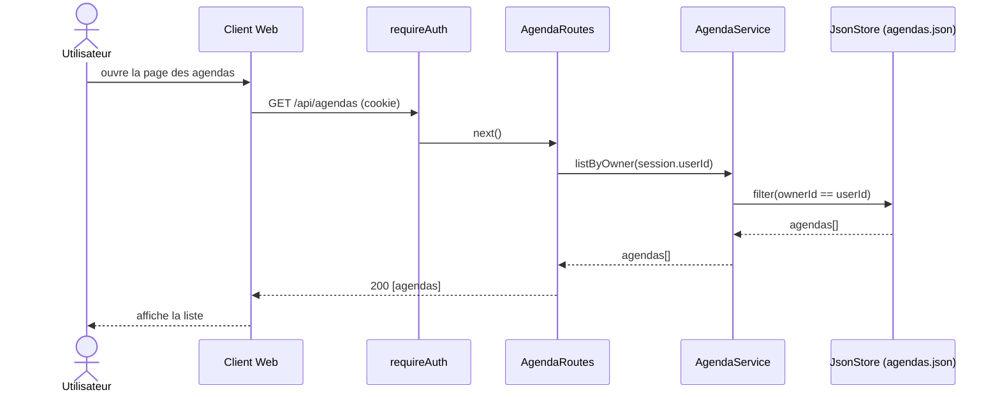

# Sprint 0: Conception

## 1. Architecture générale

Un serveur unique Node.js / Express qui :
- sert les pages Web statiques (`public/`) ;
- expose une API REST JSON sous le préfixe `/api` ;
- persiste les données dans des fichiers JSON (`data/`).



### Arborescence du projet

```
├── README.md              # installation et lancement (npm install && npm start)
├── package.json
├── server.js              # point d'entrée (Express, port 3000)
├── src/
│   ├── routes/
│   │   ├── authRoutes.js
│   │   └── agendaRoutes.js
│   ├── middleware/
│   │   └── requireAuth.js
│   ├── services/
│   │   ├── UserService.js
│   │   └── AgendaService.js
│   ├── models/
│   │   ├── User.js
│   │   └── Agenda.js
│   └── storage/
│       └── JsonStore.js
├── public/                # client Web (HTML / CSS / JS)
│   ├── index.html
│   ├── css/
│   └── js/
├── data/                  # fichiers de persistance (créés au 1er lancement)
│   ├── users.json
│   └── agendas.json
└── sprint0/               # documents Scrum du sprint 0
    ├── backlog.md
    ├── conception.md
    ├── review.md          # ajouté en fin de sprint
    └── retrospective.md   # ajouté en fin de sprint
```

## 2. Choix techniques

| Besoin | Choix | Justification |
|--------|-------|---------------|
| Serveur HTTP | Express | Simple, standard, routes statiques + API dans un même serveur |
| Sessions | `express-session` (cookie de session) | Gestion simple de l'identification multi-utilisateurs |
| Mots de passe | `bcryptjs` | Stockage haché, jamais en clair |
| Identifiants | `crypto.randomUUID()` | Natif Node.js, pas de dépendance |
| Persistance | Fichiers JSON | Autorisé par le sujet, pas de base de données à déployer |
| Écriture fichiers | Écriture dans un fichier temporaire puis `rename` | Évite de corrompre les données si le serveur s'arrête pendant une écriture |
| Client | HTML / CSS / JavaScript (`fetch`) | Pas de build nécessaire, lancement direct |

## 3. Diagramme de classes

La classe `RendezVous` (stéréotype `<<Sprint 1>>`) est prévue pour le Sprint 1 et n'est pas implémentée dans ce sprint.



## 4. API REST: Sprint 0

| Méthode | Route | Auth | Corps (JSON) | Réponse |
|---------|-------|------|--------------|---------|
| GET | `/` | Non | — | `index.html` |
| POST | `/api/auth/register` | Non | `{ username, password }` | `201` utilisateur créé / `400` champ vide / `409` nom déjà pris |
| POST | `/api/auth/login` | Non | `{ username, password }` | `200` utilisateur / `401` identifiants invalides |
| POST | `/api/auth/logout` | Oui | — | `204` |
| GET | `/api/auth/me` | Oui | — | `200` utilisateur connecté / `401` |
| GET | `/api/agendas` | Oui | — | `200` liste des agendas de l'utilisateur |
| POST | `/api/agendas` | Oui | `{ name, color? }` | `201` agenda créé / `400` nom vide |

L'API ne renvoie jamais `passwordHash` (méthode `User.toPublic()`).

## 5. Format des fichiers de données

`data/users.json`
```json
[
  {
    "id": "b3f1c2e4-...",
    "username": "manuel",
    "passwordHash": "$2b$10$...",
    "createdAt": "2026-10-01T10:00:00.000Z"
  }
]
```

`data/agendas.json`
```json
[
  {
    "id": "a91d7f20-...",
    "name": "Cours",
    "color": "#3b82f6",
    "ownerId": "b3f1c2e4-...",
    "createdAt": "2026-10-01T10:05:00.000Z"
  }
]
```

## 6. Diagrammes de séquence

### 6.1 Inscription (US01)



### 6.2 Connexion (US02)



### 6.3 Déconnexion (US03)



### 6.4 Création d'un agenda (US04)



### 6.5 Liste des agendas (US05)



## 7. Maquette de l'interface (Sprint 0)

```
┌─────────────────────────────────────────────┐
│  ChronoSquad Agenda          [manuel] [⏻]   │
├──────────────┬──────────────────────────────┤
│ Mes agendas  │                              │
│ ☑ Cours      │   (zone calendrier —         │
│ ☑ Perso      │    rendez-vous au Sprint 1)  │
│              │                              │
│ [+ Nouvel    │                              │
│    agenda]   │                              │
└──────────────┴──────────────────────────────┘
```
